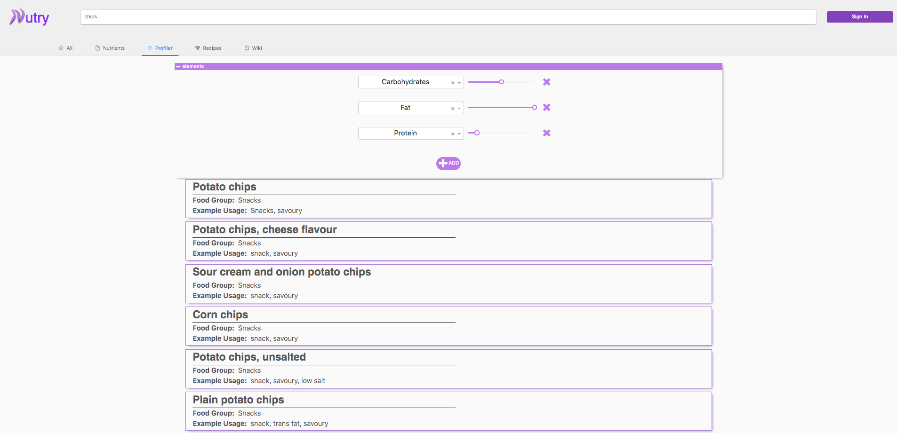

# Nutry

## About
Nutry provides a flexible and easier interaction with nutritional data for a  
large range of food items totalling over 11000 unique items. All of these
items have been indexed into Elasticsearch enabling advanced search capabilities,
additionally each item has been enriched with extra clinical and nutritional
metadata enables advanced filtering and more relevant ranking of search
results.

## Search
A search interface is provided for users to search for food items. This search
handles typos and multiple sentence combinations.

## Profiler
The profiler tab at the search interface enables a deeper dive into how search
results are to be ranked and queried. Providing a multi-dimensional search
criteria to be set, with a slider allowing variations, search results will
update in real-time.

## Food Profile Dashboard
A breakdown of nutritional content at both a "summary" and "detailed" level is
provided, enabling over 60 different nutritional values to be interacted with.
Macronutrient composition breakdowns are made available as pie-charts, with a
toolbar that enables specifics around age group and portion size to be set.
The toolbar allows a user to customise the food profile presentation to meet
their most relevant context.

A relative ranking of each selected nutritional value is presented as a
horizontal bar chart. This shows the relative ranking of a selected
nutritional value when compared to other items that were presented in the
search interface.
